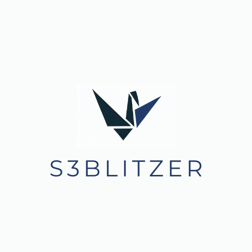
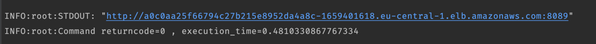
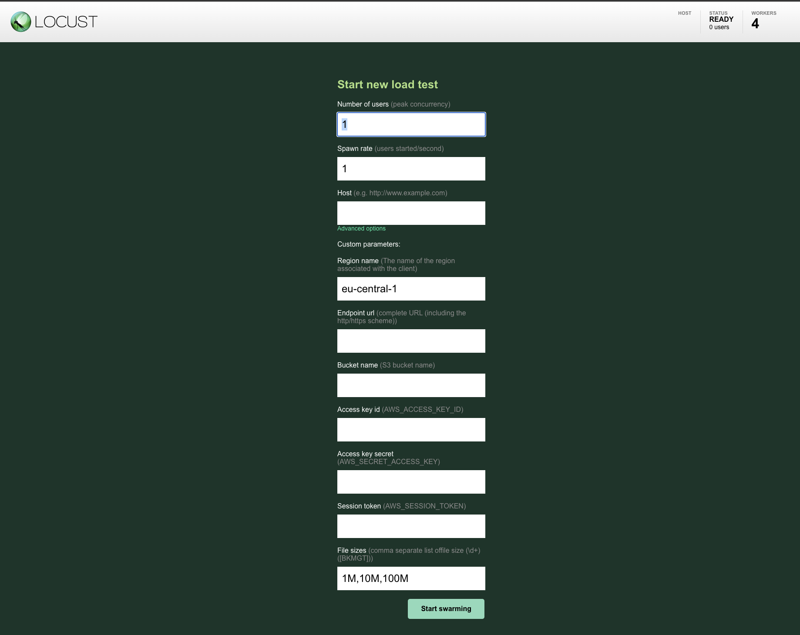
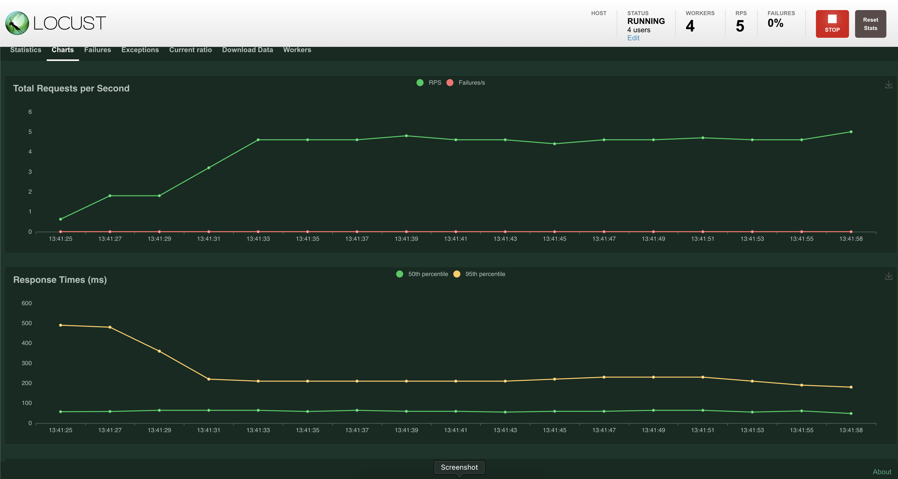

# S3Blitzer


## Overview

This load testing tool is designed to simulate realistic workloads on S3-compatible storage solutions. It enables users to assess the performance, scalability, and reliability of their S3-compatible storage infrastructure under different load conditions.

## Table of Contents

- [Features](#features)
- [Installation](#installation)
- [Usage](#usage)
- [Test Scenarios](#test-scenarios)
- [Contributing](#contributing)
- [License](#license)

## Features

- Deploy and managed on AWS [EKS](https://aws.amazon.com/de/eks/).
- Support for load testing any S3-compatible storage solution.
- Customizable test scripts which use [Locust](https://github.com/locustio/locust) framework internally.
- Customizable load levels with adjustable concurrency, scale horizontally and virtual users.
- Real-time monitoring and reporting of key performance metrics during load tests.
- Detailed test results and analysis for identifying performance bottlenecks and optimizations.

## Installation

0. Prerequisites
Install and configured the following tools:
   - Python 3.11
   - aws-cli
   - terraform
   - kubectl
   - docker-cli / docker-desktop

2. Clone this repository to your local machine:

   ```
   git clone https://github.com/qng95/S3Blitzer.git
   ```

3. Install the required dependencies. We recommend using a virtual environment:

   ```
   cd blitzer
   virtualenv venv
   source venv/bin/activate   # On Windows: venv\Scripts\activate
   pip install -r requirements.txt
   ```

4. (Optional) Build s3blitzer docker image and push s3blitzer image to your repository
   ```
   docker build -t <tag> .
   docker push <tag>
   ```

4. Configure `config.toml`
   - dockerconfigjson: should point to docker config file which has docker credential. This is used by kubernetes to pull the app image to the pods.
   - locust_image: image tag that you build and push
   - locust_workers: number of workers process to scale
   - target_region: AWS region to deploy
   - cluster_name: name for your AWS EKS cluster
   - eks: configure EC2 instance type (AMI) and node groups for EKS.

6. Deploy

   ```
   (venv)$: python bootstrap.py deploy -v 
   ```

## Usage

1. After successful deployment, you will get the URL to access the Locust WebUI.
   

2. Configure the number of users you want to spin up, and the spin up rate. Put your s3 connection details and access credential in the test configuration form. Specified the list of file size that you need to test against upload/download scenario. Start the load test.
   

3. Monitor the test execution in real-time and review the generated reports after the tests complete. (Note: first run may be slow since it will need to generate test file which your configured sizes)
   
   

## Test Scenarios

The load testing tool includes some pre-defined test scenarios to get you started. 
You can find these scenarios in the `s3blitzer/s3blitzer.py` script.
Currently there are uploading file and downloading file tests.

## Contributing

Contributions to this load testing tool are welcome! If you find any issues or have ideas for improvements, please open an issue or submit a pull request. Please read our [Contributing Guidelines](CONTRIBUTING.md) for more information.

## License

This project is licensed under the [Apache License](LICENSE).
